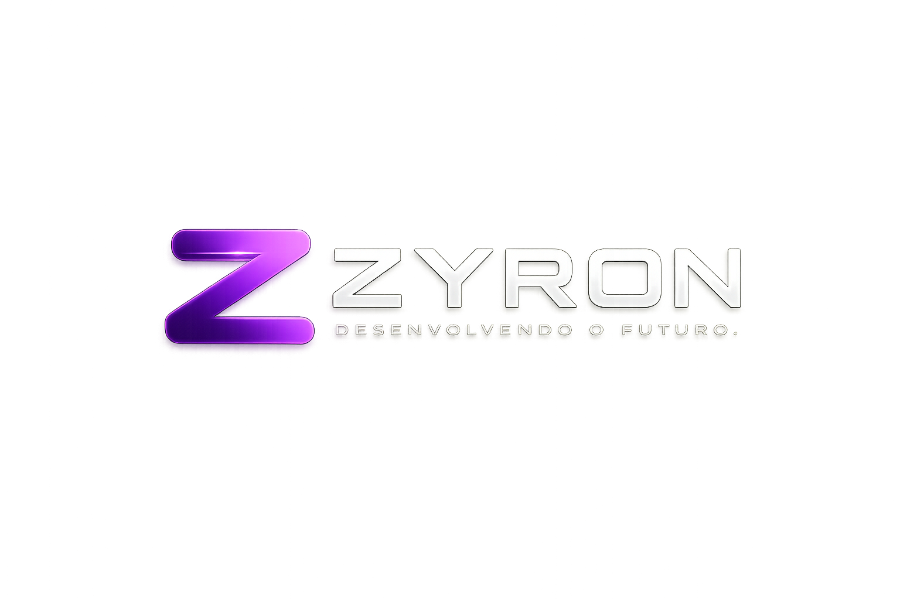

# ZYRON

### Desenvolvendo o Futuro.

Site institucional desenvolvido para representar uma empresa moderna de tecnologia, com foco em design, performance e experiência do usuário.

**🌐 Projeto Online:**  
https://zyron-one.vercel.app/

---

## 📖 Sobre o projeto

A **ZYRON** é um projeto de portfólio criado para demonstrar habilidades em desenvolvimento Front-End.

O objetivo foi construir um site moderno, responsivo e com uma identidade visual forte, simulando o site institucional de uma empresa de tecnologia.

Durante o desenvolvimento foram aplicados conceitos de:

- Design Responsivo
- UI/UX
- Animações em CSS
- JavaScript puro
- Organização de código
- Versionamento com Git e GitHub
- Deploy utilizando Vercel

---

## 🚀 Tecnologias utilizadas

- HTML5
- CSS3
- JavaScript (ES6)
- Git
- GitHub
- Vercel

---

## ✨ Funcionalidades

- Landing Page moderna
- Layout totalmente responsivo
- Menu Mobile
- Loader animado
- Animações suaves ao navegar
- Scroll Reveal
- Botão "Voltar ao topo"
- Formulário integrado ao WhatsApp
- Design otimizado para Desktop e Mobile

---

## 📸 Preview

> Em breve serão adicionadas imagens do projeto.

---

## 🌎 Acesse o projeto

### Site

https://zyron-one.vercel.app/

### Repositório

https://github.com/felipedebom/zyron

---

---

## 💡 Objetivo

Este projeto foi desenvolvido como parte do meu processo de aprendizado em desenvolvimento Front-End, buscando criar um site com aparência profissional, boa organização e foco na experiência do usuário.

---

## 👨‍💻 Autor

**Felipe de Bom**

GitHub:
https://github.com/felipedebom

---

### ⭐ Se você gostou do projeto, deixe uma estrela no repositório.

